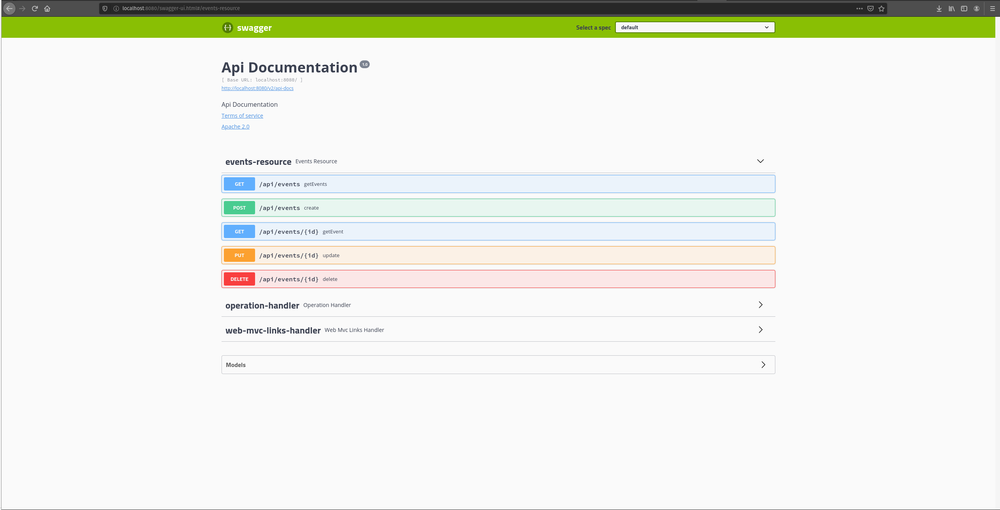

# Sample Spring Boot Rest API

A sample project that illustrates how to create a rest api using [Spring Boot](https://spring.io/projects/spring-boot)

## Getting Started

## Usage

`>> mvn spring-boot:run`

The go to the browser url displayed in the screenshot below:

### Reference Documentation
For further reference, please consider the following sections:

* [Official Apache Maven documentation](https://maven.apache.org/guides/index.html)
* [Spring Boot Maven Plugin Reference Guide](https://docs.spring.io/spring-boot/docs/2.2.3.RELEASE/maven-plugin/)
* [Spring Web](https://docs.spring.io/spring/docs/current/spring-framework-reference/web.html)
* [Spring Data MongoDB](https://docs.spring.io/spring-boot/docs/2.2.3.RELEASE/reference/htmlsingle/#boot-features-mongodb)
* [Spring Boot Actuator](https://docs.spring.io/spring-boot/docs/2.2.3.RELEASE/reference/htmlsingle/#production-ready)
* [Springfox Swagger](https://springfox.github.io/springfox/docs/current/)
